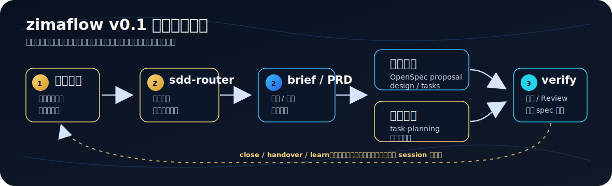

# zimaflow

<p align="center">
  <a href="https://github.com/zima-explorer/zima-flow/actions/workflows/ci.yml"></a>
  <a href="https://github.com/zima-explorer/zima-flow/stargazers"></a>
  <a href="https://github.com/zima-explorer/zima-flow/network/members"></a>
  <a href="LICENSE"></a>
</p>

zimaflow 是一套轻量 AI Coding 工作流，用来把一句粗略需求整理成可追踪的实现闭环。

它面向**个人开发者和小团队**：不追求企业级流程治理，而是用最少的约束把需求、规范、实现和收口串成一条可追踪、可交接的轻工作流。多数需求走 brief 就够，只有真正复杂的场景才升级到完整模式，避免小改动背上重流程的负担。

它不是完整的 agent 框架，不是项目管理系统，也不是个人工作区的镜像。v0.1 是经过公开发行审查的一条主链路，让读者可以完整体验：需求进入、需求契约、任务拆解、OpenSpec/Superpowers 衔接、合规检查、handover、session 收口和经验沉淀。

这条主链路包括：

1. 路由需求
2. 确认轻量需求契约
3. 将 first slice 拆成任务
4. 使用 OpenSpec 作为规范层
5. 用 Superpowers 风格的执行纪律进入实现
6. 在 session 之间交接上下文
7. 通过文档对账和经验沉淀完成收口

它和一个通用的"spec-driven"封装不同的地方在于几层真实工程护栏：

- **需求先立契约**：进入规划前强制一份已确认的 brief/PRD，验收标准优先写成 Given/When/Then，反问最多 2 轮后取默认值，不无限追问。
- **实现有破坏性护栏**：合规检查内置破坏性变更门槛（删码/改公共接口/改 schema/改权限/改写库路径先排查引用面）和沿用现有抽象检查，只标记、交用户决策，不自动改。
- **老项目能接管**：`legacy-project-onboarding` 给存量代码库快速建立架构、接口、数据模型和隐性知识的认知底座，配一份 thin context index 让后续 session 不必每次重扫全仓。
- **收口有 Guardrail**：session 收尾对账覆盖 hotfix / rewind / secrets 三类风险，密钥只记 `path:line`、绝不外泄。

这个仓库是公开发行版，只保留经过发行审查的主链路，比完整开发流程更精简。

## 只要记住三件事

zimaflow 的入口刻意保持低记忆负担：

1. **从 `skills/sdd-router.md` 开始**：先判断这是轻量模式、完整模式、排障，还是需要纠偏 / rewind。
2. **复杂需求进入 OpenSpec**：需求契约先落 brief/PRD，再由 `route-decision-recorder` 和 `openspec-superpowers-bridge` 接到 proposal/design/tasks。
3. **结束前跑收口**：用 `bin/zimaflow close` 或 `session-close-reconciler` 对账 handover、closing、Guardrail 和经验候选，避免 session 只在聊天里结束。

## 工作流一眼看懂



这张图只保留 v0.1 主链路；完整协同全景图见延伸说明：[一张图看懂 AI Coding 轻工作流：从需求入口到经验回流](https://mp.weixin.qq.com/s/TqgHNpYo37qC0gvXOtuNCg)。

## 可靠性机制

zimaflow 不追求把 agent 变成全自动运行时，而是把容易漂移的关键点显式化：

- **需求 Gate**：`requirement-contract` 要求目标、范围、Non-goals、验收标准和默认假设先确认，降低后续实现偏航。
- **路线 Gate**：完整模式通过 `route-decision-recorder` 记录路线选择、影响面和 first slice，避免 OpenSpec change 只是补文档。
- **实现 Gate**：`spec-compliance-check` 对照 spec 检查实现，并标记 B4 破坏性变更和 B5 沿用抽象风险。
- **交接 Gate**：`handover-manager` 保存下一次 session 必须知道的状态、未决事项和 Guardrail 承接。
- **收口 Gate**：`session-close-reconciler` 在 final response 前核对 hotfix / rewind / secrets、文档同步和经验候选。

这些 Gate 默认是提醒和审查，不是强制阻断；v0.1 的目标是让个人和小团队先得到可解释、可交接的纪律，而不是一开始就引入重型平台。

## 可以从这里学到什么

即使不直接采用整套流程，也可以拆开学习这些做法：

- 如何把一句粗略需求压成 brief，并用 Given/When/Then 写出可派生测试的验收标准。
- 如何决定轻量模式和完整模式的边界，让小改动不背重流程，大改动不跳过路线决策。
- 如何把 OpenSpec 当作规范层，而不是把它变成事后归档。
- 如何给存量项目建立 thin context index，让后续 agent session 少做重复考古。
- 如何在 session 收尾时检查文档、handover、secrets 和经验候选，让上下文不只停留在对话窗口里。

## v0.1 纳入内容

| 范围 | 文件 | 状态 |
|------|------|------|
| 需求路由 | `skills/sdd-router.md` | 纳入（含排障路径、P1/P2/P3 变更分级、rewind、context index） |
| 需求契约 | `skills/requirement-contract.md` | 纳入（含 Given/When/Then、反问上限） |
| 任务拆解 | `skills/task-planning.md` | 纳入 |
| 路线决策 | `skills/route-decision-recorder.md` | 纳入 |
| OpenSpec 到执行衔接 | `skills/openspec-superpowers-bridge.md` | 纳入 |
| 规范合规检查 | `skills/spec-compliance-check.md` | 纳入（含 B4 破坏性变更 / B5 沿用抽象护栏） |
| 老项目认知底座 | `skills/legacy-project-onboarding.md` | 纳入 |
| handover | `skills/handover-manager.md` | 纳入（含 Guardrail 承接、state/index） |
| session 收口 | `skills/session-close-reconciler.md` | 纳入（含 hotfix/rewind/secrets Guardrail） |
| 经验沉淀 | `skills/learn.md` | 纳入 |
| 参考表 | `references/*.md` | 纳入，已脱敏 |
| agent 规则 | `rules/` | 纳入 |
| 基础安装脚本 | `scripts/install.sh` | 纳入 |
| 最小 CLI | `bin/zimaflow` | 纳入 |

## 后续规划

以下能力已完成开发与打磨，计划在后续版本随公开示例和稳定模板逐步开放：

| 方向 | 亮点 |
|------|------|
| 产品原型评审（`proto-review`） | 想法或 PRD 一键转成可评审原型，先看得见再写 spec。 |
| 一键初始化器 | 一条命令接入新项目，自动配好 OpenSpec、规则和 skills。 |
| 完整 CLI | 在 `close` 之外补上状态跟踪、知识淘汰复查和交接漂移检查。 |
| 知识使用闭环 | 经验从"靠记忆"变成可追踪、可淘汰的账本。 |

完整范围与规划见 [docs/open-source-boundary.md](docs/open-source-boundary.md)。

## 目录关系

```text
zimaflow/
  skills/              # 主链路执行单元
  rules/               # 跨 skill 共享约束
  references/          # 辅助模板、矩阵和背景说明
  docs/                # 面向外部读者的人类文档
  examples/demo/       # v0.1 完整体验入口
  scripts/             # 基础安装脚本
  bin/                 # 最小 zimaflow CLI
```

`skills/` 描述 agent 应该怎么执行；`rules/` 保存跨 skill 的共同约束；`references/` 放可被 skill 引用的辅助材料；`docs/` 面向读者解释项目；`examples/demo/` 是最快体验 v0.1 主链路的入口。

## 快速开始

### 1. 30 秒确认它能跑

clone 下来直接运行收口检查，无需安装或配置：

```bash
git clone https://github.com/zima-explorer/zima-flow.git
cd zima-flow
bin/zimaflow close
```

会立即输出当前仓库的 git 状态和下一步建议——这是最小的可运行证明。

### 2. 3 分钟看一条真实需求走完主链路

demo 用一句需求 `Add a tiny todo list CLI ...` 演练了整条链路，产物直接看这几个文件：

- 需求 brief（含 Given/When/Then 验收标准）：[todo-cli-brief.md](examples/demo/project-docs/demo-cli/docs/Requirements/2026-07-11-todo-cli-brief.md)
- 任务拆解（first slice）：[todo-cli-tasks.md](examples/demo/project-docs/demo-cli/docs/Tasks/2026-07-11-todo-cli-tasks.md)
- OpenSpec change 骨架：[add-todo-cli/](examples/demo/project-docs/demo-cli/openspec/changes/add-todo-cli/)
- 收口对账：[todo-cli-closing.md](examples/demo/project-docs/demo-cli/docs/Closing/2026-07-11-todo-cli-closing.md)
- session handover：[handover-todo-cli.md](examples/demo/project-docs/demo-cli/docs/Handover/2026-07-11-handover-todo-cli.md)

走查引导见 [examples/demo/README.md](examples/demo/README.md)。想深入每个 skill，从入口 [`skills/sdd-router.md`](skills/sdd-router.md) 开始，完整清单见 [docs/getting-started.md](docs/getting-started.md)。

### 3. 安装到本地使用

```bash
scripts/install.sh --target "$HOME/.zimaflow"
```

安装脚本只复制公开仓内容，不初始化 OpenSpec、不创建项目注册表、不修改 shell profile 或 agent 配置。demo 运行所需的环境变量在 [examples/demo/README.md](examples/demo/README.md) 中说明。

`bin/zimaflow` 是可选的最小 CLI：它提供 `close`、`close --json` 和非阻断 hook 提醒，适合作为全局收口探针，不是完整工作流引擎。想在任意项目里直接运行 `zimaflow close` 时，再把它安装到 PATH 目录：

```bash
scripts/install.sh --target "$HOME/.zimaflow" --bin-dir "$HOME/.local/bin"
```

`skills/` 是 zimaflow 的中立源文件。Codex、WorkBuddy 等在你显式指定源目录或运行环境支持递归读取时，优先直接使用仓库里的源文件，不需要改成特殊目录名；如果你希望某个 agent 走自动发现，仍要按该 agent 实际扫描的结构生成 adapter。

只有在你希望 **Claude Code 自动发现** zimaflow skills 时，才需要生成一层扁平 adapter。原因是 Claude Code 的全局 skill 发现只扫描 `<skill-root>/<skill>/SKILL.md` 这一层，不会递归理解 `skills/*.md` 这样的源结构。

若多个 agent 共用一个已配置好的全局 skill root，也可以把 adapter 安装到这个 root：

```bash
scripts/install.sh --target "$HOME/.zimaflow" \
  --adapter-dir "/path/to/global-skill-root"
```

如果不同 agent 各自维护全局目录，只给确实需要 adapter 的 agent 指定对应 root。最常见的是 Claude Code；其他 agent 只有在你的运行环境也要求一层 `SKILL.md` 自动发现结构时才需要：

```bash
scripts/install.sh --target "$HOME/.zimaflow" \
  --adapter-dir "$HOME/.claude/skills"
```

adapter 结构统一使用扁平的 `zimaflow-<name>/SKILL.md` 命名，而不是 `zimaflow/<name>/SKILL.md` 子目录。这个命名是 runtime 兼容层，不是源码组织方式；它主要服务 Claude Code 自动发现，同时避免和用户已有 skill 重名。

若只想让某个项目里的 Claude Code 自动发现，可在项目根目录使用 `--claude-code` 生成项目级 adapter；其他需要一层 `SKILL.md` 结构的宿主也可以用 `--adapter-dir <dir>` 指向它实际扫描的目录。安装后把 `ZIMAFLOW_HOME` 指向目标目录，skill 内对 `references/` 的引用统一走 `$ZIMAFLOW_HOME/references/`。详见 [docs/getting-started.md](docs/getting-started.md)。

可选：如果已安装 CLI，可在 git 仓库里装一个非阻断提醒 hook，提交或推送前提示你跑一次收口检查（不拦截提交，已有 hook 会跳过）：

```bash
bin/zimaflow install-hooks
```

## 设计原则

- 多数小需求用 brief 就够，不强制完整 PRD。
- OpenSpec 负责规范层；完整模式的实现不应跳过规范上下文。
- handover 和收口检查是工作流的一部分，不是事后补丁。
- 公开发行文件必须脱敏，不依赖任何未公开的内部资源。

## 参与贡献

欢迎提 issue 和 PR。参与前请先读：

- [CONTRIBUTING.md](CONTRIBUTING.md) — 本地验证、公开措辞与脱敏要求、提交流程。
- [CODE_OF_CONDUCT.md](CODE_OF_CONDUCT.md) — 社区行为准则。
- [SECURITY.md](SECURITY.md) — 安全问题请私下报告，勿走公开 issue。

日常使用问题、建议和交流，也可以在微信搜索并关注公众号 **zima-explorer**，私信反馈；公众号里也有一些 AI Coding 工作流的相关实践文章可供参考。安全漏洞请勿走公众号或公开 issue，见 [SECURITY.md](SECURITY.md)。

版本变更记录见 [CHANGELOG.md](CHANGELOG.md)。

## 许可证

本项目使用 [MIT 许可证](LICENSE)。
