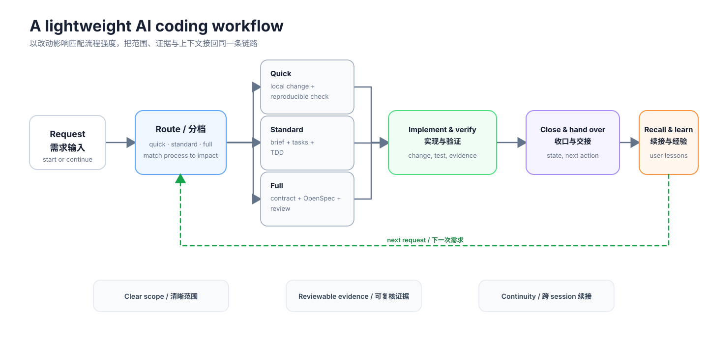

# Zimaflow

<p align="center">
  <a href="https://github.com/zima-explorer/zima-flow/releases"></a>
  <a href="https://github.com/zima-explorer/zima-flow/stargazers"></a>
  <a href="https://github.com/zima-explorer/zima-flow/network/members"></a>
  <a href="LICENSE"></a>
</p>

[English](README.md) | [简体中文](README.zh-CN.md)

## Why Zimaflow

AI coding makes implementation faster, but it can leave requirements, key
decisions, verification, and context scattered across a chat, a branch, and a
developer's memory. Zimaflow is the workflow layer that reconnects those parts
into an engineering loop you can execute, review, and resume.

It gives individual developers and small teams three practical benefits:

- **Less avoidable rework:** agree on the goal, scope, and acceptance before
  implementation begins.
- **Reviewable evidence:** connect tasks and specifications to implementation
  checks, rather than treating a chat response as proof that work is done.
- **Continuity across sessions:** preserve the current state, open questions,
  and next action in handovers instead of asking a new session to reconstruct
  the work from scratch.

Zimaflow is not an AI coding agent, a project-management system, or a copy of
your personal workspace. It works with Claude Code, Codex, and WorkBuddy to
give their coding capabilities a reliable engineering process.

## How it works

Route the request → agree on a lightweight contract → plan the first slice →
implement with discipline → verify the result → hand over and close the
session with reusable lessons.

For a complex change, Zimaflow coordinates OpenSpec for the specification and
implementation workflow. For a small change, it keeps the evidence and scope
clear without forcing a heavyweight process.



## Keep it lightweight

Most requests start with a brief, not a full specification. Zimaflow raises the
level of process only when a change is complex or risky enough to need it. Its
gates make important decisions visible for people to review; they do not turn
every task into a compliance ceremony.

## Quick start

Install the CLI for the host you use before adding Zimaflow. This checkout
contains Zimaflow 1.22.7.

Claude Code:

```sh
claude plugin marketplace add zima-explorer/zima-flow
claude plugin install zimaflow@zimaflow
```

Codex:

```sh
codex plugin marketplace add zima-explorer/zima-flow
codex plugin add zimaflow@zimaflow
```

## Restricted networks

The owner/repository commands above use GitHub over HTTPS. If GitHub HTTPS
access is restricted, clone the repository over SSH and register the local
checkout from its parent directory:

```sh
git clone git@github.com:zima-explorer/zima-flow.git
claude plugin marketplace add ./zima-flow
codex plugin marketplace add ./zima-flow
```

## Verify the installation

List the installed plugin in each host:

```sh
claude plugin list
```

```sh
codex plugin list
```

For WorkBuddy, set the absolute distribution and project roots. The version
command runs from the distribution checkout. Doctor targets an initialized
Zimaflow project, which must contain at least `.zimaflow/project.yaml` and
`openspec/config.yaml`:

```sh
ZIMAFLOW_ROOT=/absolute/path/to/zima-flow
PROJECT_ROOT=/absolute/path/to/your-project

"$ZIMAFLOW_ROOT/runtime/zimaflow/bin/zimaflow" --version
"$ZIMAFLOW_ROOT/runtime/zimaflow/bin/zimaflow" doctor workbuddy \
  --project "$PROJECT_ROOT" \
  --runtime-manifest "$ZIMAFLOW_ROOT/adapters/workbuddy/runtime-manifest.yaml"
```

## WorkBuddy

WorkBuddy uses the portable runtime at `runtime/zimaflow` through the adapter
contract in `adapters/workbuddy/runtime-manifest.yaml`. The distribution provides
the runtime; doctor evaluates the initialized project selected by `--project`.
WorkBuddy does not require a marketplace entry.

## Update or remove

Update or remove the Claude Code plugin and its marketplace entry:

```sh
claude plugin update zimaflow@zimaflow
claude plugin uninstall zimaflow@zimaflow
claude plugin marketplace remove zimaflow
```

Refresh the Codex marketplace snapshot, or remove the plugin and marketplace
entry:

```sh
codex plugin marketplace upgrade zimaflow
codex plugin remove zimaflow@zimaflow
codex plugin marketplace remove zimaflow
```

## Verify the release

Verify a checkout from its repository root:

```sh
./verify-release.sh --distribution .
```

The verifier checks the version, manifest structure, artifact hashes, and any
drift in the recorded release payload.

## What is included

- Claude Code plugin: `plugins/claude`
- Codex plugin: `plugins/codex`
- WorkBuddy adapter: `adapters/workbuddy`
- Shared runtime: `runtime/zimaflow`

## Integrity and trust

`release-manifest.yaml` records the expected artifact and payload hashes. The
verifier recalculates them and reports drift when the checkout no longer matches
those recorded values.

The manifest is not signed, so this integrity check is not proof of who created
the release and does not establish cryptographic authenticity.

## License

Zimaflow is available under the MIT License. See [LICENSE](LICENSE) and
[THIRD_PARTY_NOTICES](THIRD_PARTY_NOTICES).
