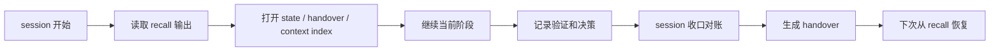

# 跨 session 续接模型

本文是 zimaflow 后续公开版本的设计说明草案，用来解释一个目标：让下一次 AI coding session 能接上当前进度，而不是只依赖聊天窗口里的记忆。

这不是新的 memory 系统，也不是项目管理平台。zimaflow 的思路是把已经存在的几类轻量产物连接起来，让它们分别回答不同问题。

## 核心组件

| 组件 | 回答的问题 | 典型载体 |
|------|------------|----------|
| Context Index | 这个项目的慢变背景在哪里读？ | 项目文档目录下的 context index |
| Zimaflow State | 当前 change 到哪一步了？ | OpenSpec change 下的状态文件 |
| Handover | 本轮为什么这样做、改了什么、下一步怎么接？ | 项目文档里的 handover |
| Recall | 下次 session 应先看什么？ | `zimaflow recall` 类读取命令 |
| Drift Check | 交接后关键契约和 spec 是否变过？ | `zimaflow drift-check` 类检查命令 |

## 生命周期

## 设计边界

- `recall` 只读，不自动修改 state、handover 或代码。
- state 只记录机器可读的短状态，不替代 proposal、design、tasks 或 handover。
- handover 记录过程、决策和下一步，不把长日志、密钥值或完整上下文塞进去。
- context index 只保存慢变入口和最新指针，不复制项目文档正文。
- drift check 只提醒关键产物可能变化，不替代人工确认。

## 推荐用法

以下入口以当前仓库的单仓 CLI 能力为准；跨项目 recall 仍是后续候选方向。

| 场景 | 建议入口 |
|------|----------|
| 几天后回到同一项目 | 先运行 recall，再打开最新 handover |
| 多个未完成 change 同时存在 | 先看 active change 列表和 bit-rot 提醒 |
| handover 之后有人改过 spec | 运行 drift check，再决定是否继续 |
| 发布前需要确认状态 | 运行 release readiness 检查，再把缺口写入 handover |

## 不做

- 不把所有需求强制升级到完整模式。
- 不默认启用阻断式 hook。
- 不用 CLI 代替用户确认需求、spec review 或发布判断。
- 不依赖未公开的个人知识库、项目注册表或私有服务。

这个模型会作为 v0.2 系列的公开方向逐步落地。早期公开版用户仍可以把本文当作设计说明，理解 handover、state 和收口检查为什么要分开保存。
