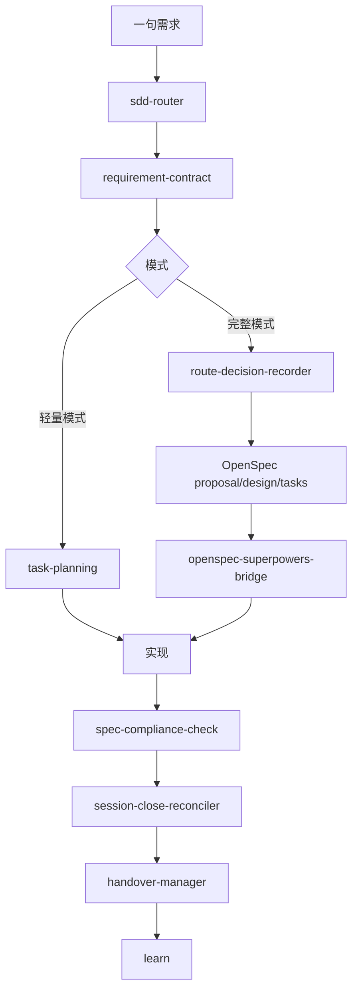

# 工作流概览

zimaflow 的核心想法很简单：用足够轻的规划让实现变得有纪律，再保存下一次 session 需要的上下文。

## 主链路

## 模式

`brief` 是小需求的默认需求契约，记录目标、范围、不做什么、验收标准和风险。

`prd` 用于产品复杂度更高、多状态、多角色、涉及敏感信息或需要团队协作的需求。

`轻量模式` 适合低风险、局部改动。

`完整模式` 适合需要路线决策、OpenSpec change 和更强审查记录的改动。

## 公开发行边界

公开项目保留稳定的小主链路：

- sdd-router
- requirement-contract
- task-planning
- openspec-superpowers-bridge
- implementation
- spec-compliance-check
- handover-manager
- session-close-reconciler
- learn

实验性模块需要等到有公开示例、稳定模板，并且不依赖源工作区后再纳入。
