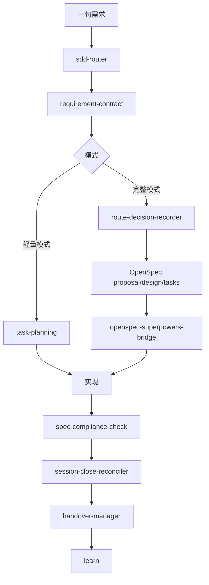
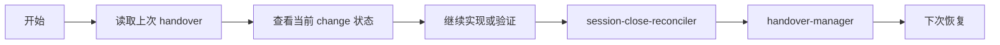

# 工作流概览

zimaflow 的核心想法很简单：用足够轻的规划让实现变得有纪律，再保存下一次 session 需要的上下文。

## 主链路

```mermaid
flowchart TD
  A["一句需求"] --> B["sdd-router"]
  B --> C["requirement-contract"]
  C --> D{"模式"}
  D -->|轻量模式| E["task-planning"]
  D -->|完整模式| F["route-decision-recorder"]
  F --> G["OpenSpec proposal/design/tasks"]
  G --> H["openspec-superpowers-bridge"]
  E --> I["实现"]
  H --> I
  I --> J["spec-compliance-check"]
  J --> K["session-close-reconciler"]
  K --> L["handover-manager"]
  L --> M["learn"]
```

## 模式

`brief` 是小需求的默认需求契约，记录目标、范围、不做什么、验收标准和风险。

`prd` 用于产品复杂度更高、多状态、多角色、涉及敏感信息或需要团队协作的需求。

`轻量模式` 适合低风险、局部改动。

`完整模式` 适合需要路线决策、OpenSpec change 和更强审查记录的改动。

## 续接视角

一次需求不一定在一个 session 里完成。zimaflow 把续接拆成几种产物，各自保持轻量：

```mermaid
flowchart LR
  A["开始"] --> B["读取上次 handover"]
  B --> C["查看当前 change 状态"]
  C --> D["继续实现或验证"]
  D --> E["session-close-reconciler"]
  E --> F["handover-manager"]
  F --> G["下次恢复"]
```

当前公开版已经纳入 handover、state/index 约定、session 收口，以及单仓 `state` / `recall` first slice；drift check、release readiness 这类只读入口仍在后续候选范围。设计说明见 [跨 session 续接模型](session-continuity.md)。

`spec-compliance-check`（上图节点 J）在真实案例中的产物不只是一句"合规检查已通过"，而是一份独立、可链接的 Spec Compliance Report，见 [examples/demo/case-cross-session 的 review/compliance 报告](../examples/demo/case-cross-session/project-docs/docs/Reviews/2026-07-24-configurable-path-compliance-report.md)。

## 公开发行边界

公开项目保留稳定的小主链路：

- sdd-router
- requirement-contract
- task-planning
- route-decision-recorder
- openspec-superpowers-bridge
- implementation
- spec-compliance-check
- legacy-project-onboarding
- handover-manager
- session-close-reconciler
- learn

主链路上还内置了几层工程护栏：需求契约的 Given/When/Then 验收标准与反问上限、合规检查的破坏性变更（B4）与沿用抽象（B5）门槛、收口的 hotfix/rewind/secrets Guardrail，以及给存量项目建立认知底座的 `legacy-project-onboarding`。

实验性模块会等到有公开示例、稳定模板，并且不依赖任何未公开资源后再纳入，详见后续规划。
